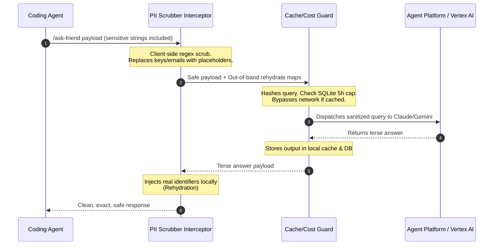

<p align="center">
  
</p>

<h1 align="center">Ask a Friend</h1>

<p align="center">
  <strong>why get stuck when specialized friend can help?</strong>
</p>

<p align="center">
  <a href="https://github.com/mbettan/ask-a-friend/stargazers"></a>
  <a href="https://github.com/mbettan/ask-a-friend/commits/main"></a>
  <a href="LICENSE"></a>
</p>

<p align="center">
  <a href="#before--after">Before/After</a> •
  <a href="#install">Install</a> •
  <a href="#setup">Setup</a> •
  <a href="#what-you-get">What You Get</a> •
  <a href="#telemetry-dashboard">Telemetry Dashboard</a> •
  <a href="#how-it-works">How It Works</a>
</p>

---

An autonomous agent plugin and local CLI that lets your coding agent phone a specialized AI friend when stuck. Built with native client-side PII scrubbing, SHA-256 prompt caching, and rolling SQLite cost guardrails to keep agentic workflows secure, fast, and cheap.

> [!NOTE]
> This skill is built on a fork of the excellent [caveman](https://github.com/JuliusBrussee/caveman.git) project. We reuse its robust multi-agent installation hooks and statusline patterns to deliver broad IDE compatibility.

## Before / After

<table>
<tr>
<td width="50%">

### 🗣️ Direct/Raw Agent Call (Vulnerable & Expensive)

> Agent sends raw contexts, absolute paths, and sensitive credentials straight to external LLMs. Runaway recursive loops can generate massive, unexpected API bills:
> * 🔓 Raw credentials (`sk-...`, `Bearer ...`) sent in plain text
> * 💸 No spending controls; recursive loops run up bills unchecked
> * ⌛ Identical prompts re-sent over the wire during rapid iterations

</td>
<td width="50%">

### 🔒 Secure Ask-a-Friend Call (Sanitized & Cached)

> A dedicated security proxy interceptor scrubs payload identifiers pre-transit, bypasses duplicate queries locally, and enforces strict spend bounds:
> * 🛡️ **PII Scrubbing** out-of-band; secrets replaced with safe placeholders
> * 🛑 **Cost Breaker** automatically halts runaway recursive loops
> * ⚡ **SHA-256 Cache** returns duplicate queries instantly (~1ms)

</td>
</tr>
</table>

**Specialized peer routing. Secure transit. Zero runaway spend.**

```
┌────────────────────────────────────────┐
│  OUT-OF-BAND PII SCRUBBING  ██████ 100%│
│  DUPLICATE CACHE LATENCY   ██████ ~1ms│
│  ROLLING SPEND BREAKERS    ██████ SQLite│
│  AUTO-ROUTING ENGINE       ██████ auto │
└────────────────────────────────────────┘
```

## Install

One command. Auto-detects and configures Claude Code, Cursor, Windsurf, Copilot, and OpenClaw workspaces.

```bash
# macOS / Linux / WSL
curl -fsSL https://raw.githubusercontent.com/mbettan/ask-a-friend/main/hooks/install.sh | bash

# Windows (PowerShell 5.1+)
irm https://raw.githubusercontent.com/mbettan/ask-a-friend/main/hooks/install.ps1 | iex
```

*Takes ~30 seconds. Requires Node ≥ 18 and Python 3. Safe to re-run.*

## Setup

### 1. Google Cloud Authentication
Authenticate your local machine to Google Cloud to access your Agent Platform or Vertex AI backend:
```bash
gcloud auth application-default login
```

### 2. Configure your GCP Project ID
You can configure your project ID using either environment variables or a persistent config file:

#### Option A: Environment Variables (Recommended for CLI / scripts)
Add this to your shell profile (e.g., `~/.zshrc` or `~/.bashrc`):
```bash
export AGENT_PLATFORM_PROJECT_ID="your-gcp-project-id"
# Optionally: export AGENT_PLATFORM_LOCATION="global"
```

#### Option B: Configuration File (Recommended for persistent IDE plugins)
Modify your local configuration file at `~/.config/ask-a-friend/config.json` (created automatically during install):
```json
{
  "vertex_project": "your-gcp-project-id",
  "vertex_location": "global",
  "cost_cap_usd": 5.00,
  "require_approval": true
}
```

## Use

Once installed, your agent can call a friend through conversational triggers or explicit tool executions:

```text
/ask-friend review src/auth.ts
"ask a friend: why is this database query locking?"
ask_a_friend @friend:claude "perform a security audit on this endpoint"
```

## What You Get

| Capability | CLI / Script Command | Description |
|---|---|---|
| **Specialized Peer Routing** | `ask_a_friend` tool | Automatically routes queries: `code_review` dispatches to `claude-garden`, while test structures run on fast, cost-efficient `gemini-pro`. |
| **PII Interceptor** | `scripts/pii.py` | Pre-transit client-side regex scrubber that strips API keys, Bearer authorization tokens, email addresses, and absolute system usernames. |
| **Circuit Breaker** | `scripts/cost.py` | SQLite-backed telemetry tracking rolling session expenses over a sliding 5h window to alert or hard-block recursive loops. |
| **Prompt Caching** | `scripts/cache.py` | Prompts and contexts are hashed via SHA-256 to resolve repeated iterations locally under 1ms. |
| **CLI Dashboard** | `python3 scripts/stats.py` | Command-center budget gauges showing exact rolling token spending, model breakdown metrics, and recent transaction history logs. |

## Telemetry Dashboard

Every request (successes, warnings, and quota errors) is logged to `~/.ask-friend/telemetry.db`. You can launch a beautiful, live-updating glassmorphic telemetry dashboard server by running:

```bash
python3 scripts/dashboard.py
```

*Once launched, navigate to **http://localhost:8080** to inspect live spend metrics, cache hit rates, and transaction details.*

## How It Works



1. **Trigger Hook**: Fired dynamically when your agent encounters a bug after 2 retries, or when explicitly queried by the user.
2. **Pre-Transit Scrubber**: Interceptor identifies potential secrets, email addresses, and local directories, substituting them with mapping tokens (`[APIKEY_1]`).
3. **Cost & Cache Check**: Prompt SHA-256 signatures are evaluated. Rolling 5-hour budgets are queried in SQLite. If clean, it dispatches to the strongest model.
4. **Out-of-Band Rehydration**: The answer is returned to the client-side interceptor, which maps placeholders back to raw identifiers.
5. **Safe Presentation**: The agent receives the technically exact, terse response securely.

## License

Apache License 2.0 — free and open-source.
